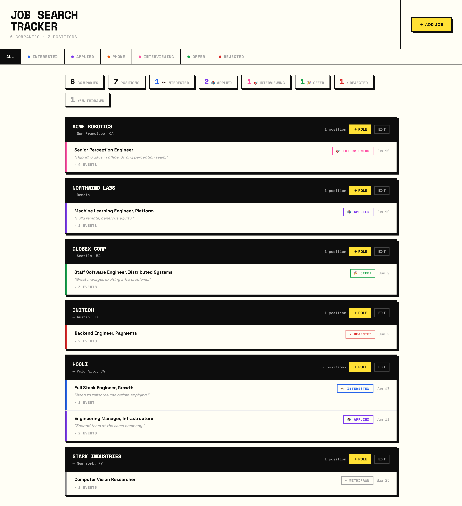

# Job Search Tracker

A lightweight, self-hosted dashboard for tracking job applications — companies, positions, and statuses — with a neo-brutalist UI and a tiny Flask backend that persists everything to a local JSON file.



> Screenshot shows sample data, not real applications.

## Features

- Track companies with multiple positions/applications nested underneath
- Per-application history timeline — log each event (applied, phone screen, interview rounds, offer) with a date; the current status is always the most recent event
- Save a snapshot of a job posting so you keep the description even after the post is removed
- Data saved to `jobs.json` on disk via a simple Flask API; snapshots saved under `snapshots/`

## Running locally

```bash
pip install flask playwright
playwright install chromium   # one-time browser download, needed for snapshots
python3 server.py
```

Then open http://localhost:5200 in your browser.

> Snapshots use a headless Chromium browser to render JavaScript-heavy job boards
> (Ashby, Workday, Greenhouse, Eightfold, …) so the full description is captured.
> If Playwright isn't installed, everything else still works — only snapshotting is disabled.
